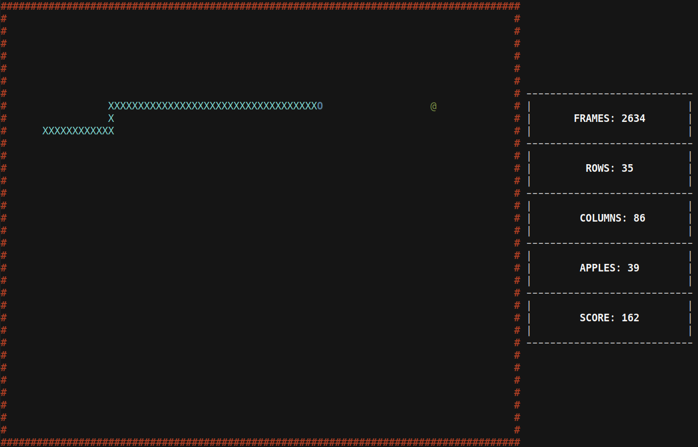

# Snake

Terminal based implementation of the Snake game for Linux, written in C++.

### How to play

The rules of the game are simple. The snake must be moved to eat all apples that appear one after the other. The snake must not touch the walls, otherwise the game is lost. To eat an apple, the head of the snake must crash into it. Every time the sanke manages to successfully do so, it gets one char longer and its speed slightly increases. The game is won when the snake occupies all available space. The game board sizes depend on the terminal window size, but they are calculated so that it is always possible to meet victory requirements. 

<p align="center">  </p>

The following keys allow you to move the snake, quit and pause the game:

- **'a'**: move the snake LEFT (has no effect if the snake is already moving LEFT or RIGHT);
- **'d'**: move the snake RIGHT (has no effect if the snake is already moving LEFT or RIGHT);
- **'w'**: move the snake UP (has no effect if the snake is already moving UP or DOWN);
- **'s'**: move the snake DOWN (has no effect if the snake is already moving UP or DOWN);

### How to compile and execute

To compile and install:

```
$ git clone https://github.com/valerioferretti92/snake.git
$ cd snake
$ make
$ ./build/snake
```

Executable and object files are placed into *snake/build* directory. 
Data regarding each match played is saved into a SQLite database place in the folder *.snake* in the home folder for future functionality implementations.
